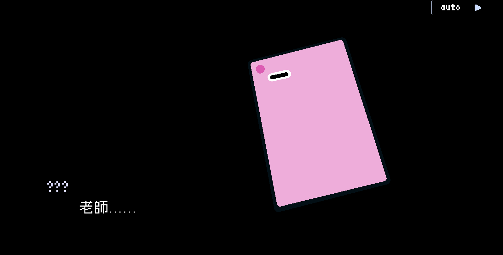
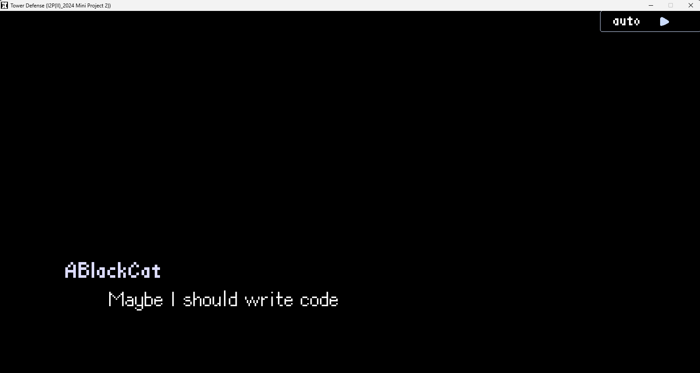
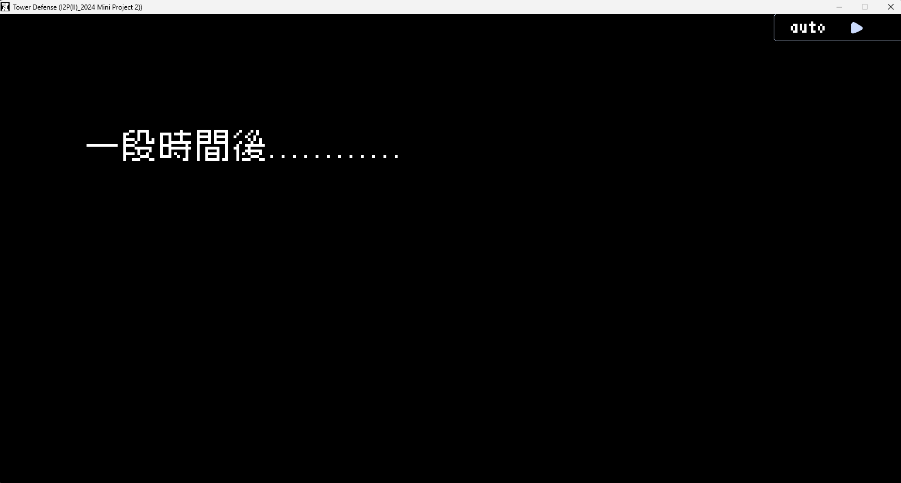
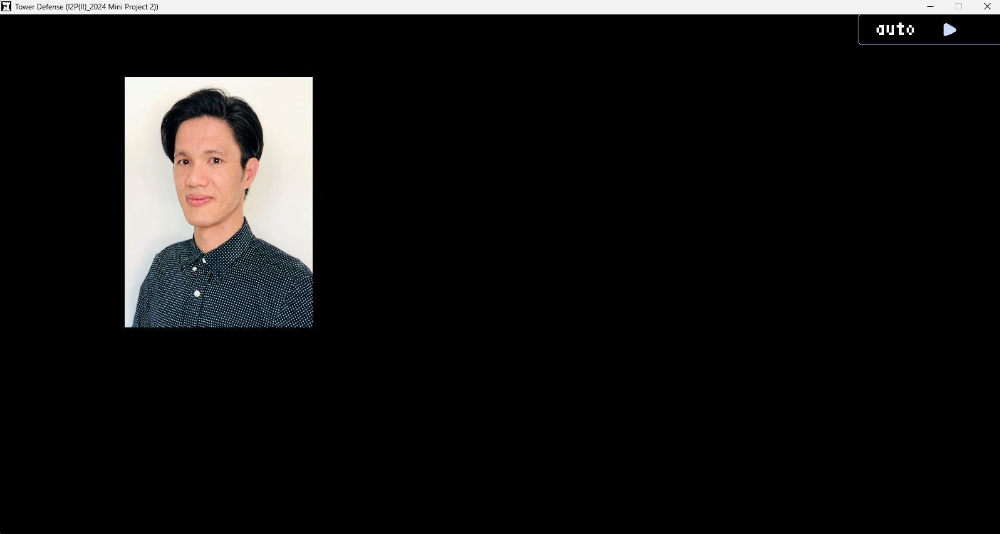

# 2024 I2P Final Project - Rhythm Defense

## Team Member
112060033 廖昱瑋、112060028 吳彥儒、112060040 劉奐均

## Game Overview
This game is a two-player cooperative game, 
with one player in charge of the rhythm game part and the other mainly in charge of the Tower defense part.

The player in charge of rhythm game needs to play as well as possible to support the tower defense player, 
you will get money by hitting notes, also,
some tower will only attack when you hit a certain number of note(s) simultaneously.

We don't modify too much on the tower defense part, 
but we synced the attack of those tower which attacks automatically with the music,
in order to maintain a sense of unity. 

The game contains 3 playable songs(or stages), 
which you need to unlock them one by one by passing the song before it on the map, 
similar to the game Lanota.

game map snapshot:


There will also be stories along the way,
presented in a visual novel way, 
similar to the game vivid/stasis or Rotaeno.

plot-engine snapshot:


## Song Credits
Stage1: Beyond Apocalypse by ABlackCat (a.k.a.吳彥儒)

Stage2: Monochrize by ABlackCat (a.k.a.吳彥儒)

Stage3: D1AB0LiC_DEV0Ti0N by Salad Savior (Free to use if informed)

Prove of informed (X(Twitter) DM):

---
## Work Allocation & Features

the one in front means do more work
cross means the one do much less work but still engaged

### Miscellaneous Tasks

| **Tasks**                                              | **Person in Charge** |
|:-------------------------------------------------------|:--------------------:|
| Come up with what we are going to do                   |     吳彥儒、~~廖昱瑋~~      |
| Write proposal                                         |       廖昱瑋、吳彥儒        |
| Provide project2 code                                  |         吳彥儒          |
| Teach team member how to use Git and GitHub (in CLion) |         吳彥儒          |
| Merge branches                                         |         吳彥儒          |
| Inform Salad Savior for song3                          |         吳彥儒          |
| Write this README.md file                              |         吳彥儒          |

---

### Plot & Plot Engine

| **Tasks**                    |                     **Person in Charge**                     |
|:-----------------------------|:------------------------------------------------------------:|
| Plan                         |                             吳彥儒                              |
| Simple Scripting Language    |                             吳彥儒                              |
| Plot Engine                  |                             吳彥儒                              |
| Plot (over 7500 words total) |                             吳彥儒                              |
| Credit to the original work  | Blue Archive (NAT Games, Publisher: NEXON Korea Corporation) |

---
### Rhythm Game

| **Tasks**                 | **Person in Charge** |
|:--------------------------|:--------------------:|
| Plan                      |         吳彥儒          |
| Sync with Rhythm          |       廖昱瑋、吳彥儒        |
| Notes fall from top       |       廖昱瑋、吳彥儒        |
| Hit notes and Judgement   |         吳彥儒          |
| Read notes                |         廖昱瑋          |
| Hold notes implementation |         廖昱瑋          |
| Visual effects            |         吳彥儒          |
| Rhythm game cheat mode    |         吳彥儒          |
---
### Story Map
| **Tasks**               | **Person in Charge** |
|:------------------------|:--------------------:|
| Plan                    |         吳彥儒          |
| Story Map               |         劉奐均          |
| Integration with others |         吳彥儒          |
---
### Tower Defense's Integration with Music
| **Tasks**                                        | **Person in Charge** |
|:-------------------------------------------------|:--------------------:|
| Plan                                             |         吳彥儒          |
| Make money by hitting notes                      |         廖昱瑋          |
| Some Towers will only attack when notes were hit |         吳彥儒          |
| Other Tower's attack sync with rhythm            |         吳彥儒          |

---
### Online Scoreboard
| **Tasks**                             | **Person in Charge** |
|:--------------------------------------|:--------------------:|
| Based on project2's scoreboard        |         吳彥儒          |
| Compile curl from source              |         吳彥儒          |
| Link the libraries in CMake           |         吳彥儒          |
| Implementation of download and upload |         吳彥儒          |
| Internal network server & code        |         吳彥儒          |
---
## Plot Scripting Language Documentation
In order to handle the story, we develop a simple scripting language: **SimRen'Py**.
This scripting language was initially intended to be very similar to Ren'Py, 
a visual novel language based on python. However, due to the implementation of my Engine, 
I changed some grammar for easier implementation in my situation!

Below are some simple documentation of our language SimRen'Py:

SimRen'Py contains of two part, the first is the preprocessing part, and the second part is the story part.
These two part needs to be seperated by a special line of words (**Plot_Start:**).
The script might look like this:

```
image Kuo "plot/Kuo.jpg" size 300 400

Plot_Start:

ABlackCat "What should I do?"
ABlackCat "Maybe I should write code"
```
---
## Preprocessing Instructions
### image
```
image image_name "path/to/your/image/from/Resource/images" size width height
```
load the image for later use
example:
```
image Kuo "plot/Kuo.jpg" size 300 400
```
---
### audio
```
audio audio_name "path/to/your/audio/from/Resource/audios"
```
load the audio for later use.

example:
```
audio notification "plot/sfx/notification.ogg"
```
---
### color
```
color character_name r g b
```
pre-assigning color to specific character name, 
the engine will automatically color the name as described if the name were later used.

example:
```
color 彩奈 224 241 245
```
---
## Instructions in the Story Part
### text
```
character_name "words the character will say"
```
Simple text display, if the character name is not colored, 
it will be colored with the default color. You can use NULL as the character name 
if you don't want to show the character name.

example:
```
ABlackCat "Maybe I should write code"
```


---
### middle
```
middle "words you want to show at the middle"
```
Display text at the middle.

example:
```
middle "一段時間後............"
```



---
### show
```
show image_name at x y
```
Show loaded image at certain position.

example:
```
image Kuo "plot/Kuo.jpg" size 300 400

Plot_Start:

show Kuo at 200 100
```


---
### hide
```
hide image_name
```
Hide certain showed image, do nothing if not showed before.

example:
```
hide Kuo
```
---
### play
```
play audio_name
```
Play loaded audio once.

example:
```
play notification
```
---
### stop
```
stop audio_name
```
Stop played audio, do nothing if the audio hasn't been played.

example:
```
stop notification
```
---

<style>
table th{
    width: 100%;
}
</style>
