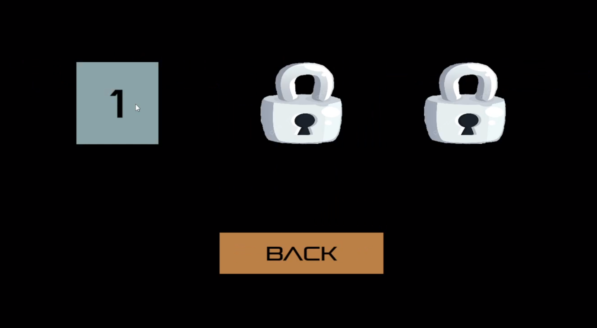
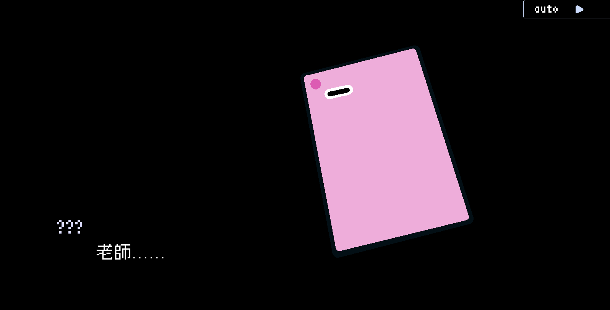
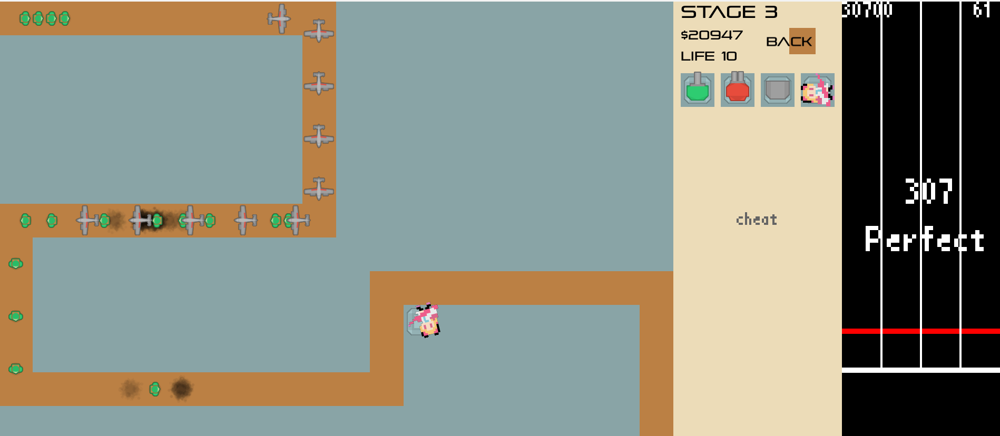
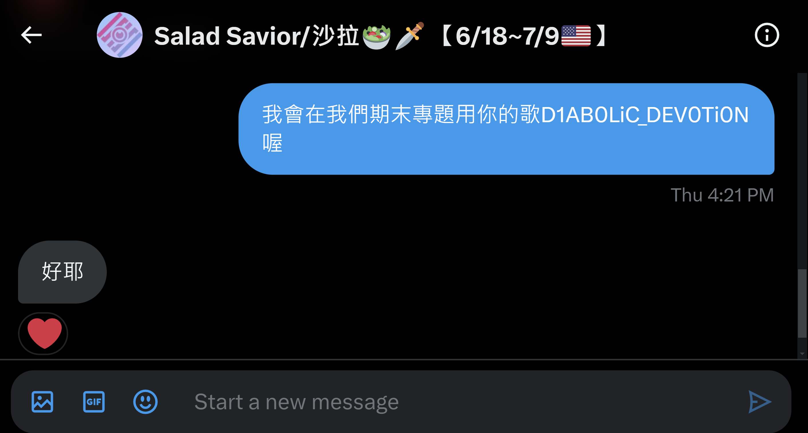
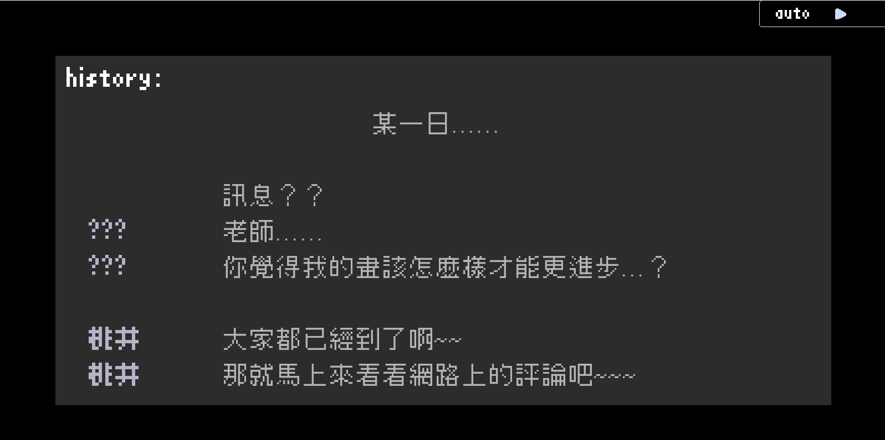
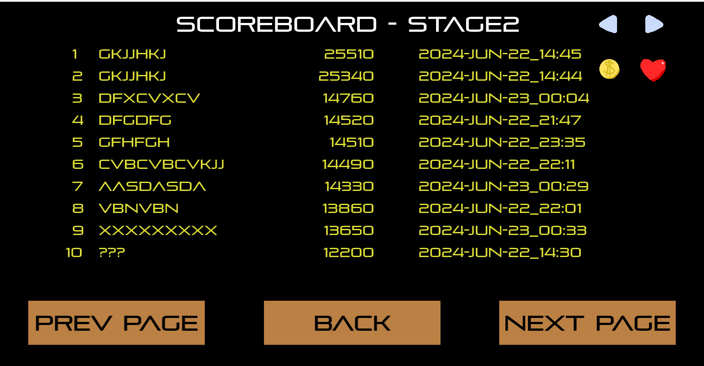
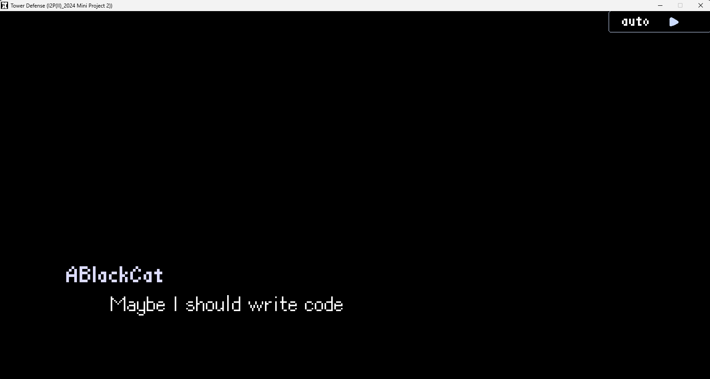
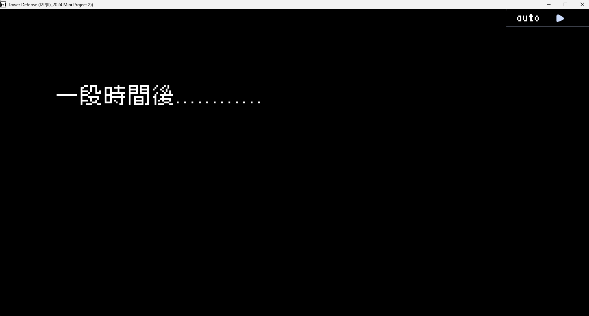

# 2024 I2P Final Project - Rhythm Defense

## Team Member
112060033 廖昱瑋、112060028 吳彥儒、112060040 劉奐均

## Game Overview
This game is a two-player cooperative game, 
with one player in charge of the rhythm game part and the other mainly in charge of the Tower defense part.

The player in charge of rhythm game needs to play as well as possible to support the tower defense player, 
you will get money by hitting notes, also,
some tower will only attack when you hit a certain number of note(s) simultaneously.

We don't modify too much on the tower defense part, 
but we synced the attack of those tower which attacks automatically with the music,
in order to maintain a sense of unity. 

The game contains 3 playable songs(or stages), 
which you need to unlock them one by one by passing the song before it on the map, 
similar to the game Lanota.

game map snapshot:


There will also be stories along the way,
presented in a visual novel way, 
similar to the game vivid/stasis or Rotaeno.

plot-engine snapshot:


Game mechanics(Rhythm game part): notes will fall from the top of the screen, and when it reaches 
a line called timing line, the user needs to press a certain key to hit the note on a certain lane. 
The final thing we implemented is very similar to osu! mania 4K.

Game mechanics(Tower defense part): We will build this part based on project2 but we will introduce 
more interaction with the music and the rhythm game part.

game snapshot:


---
## Song Credits
Stage1: Beyond Apocalypse by ABlackCat (a.k.a.吳彥儒)

Stage2: Monochrize by ABlackCat (a.k.a.吳彥儒)

Stage3: D1AB0LiC_DEV0Ti0N by Salad Savior (Free to use if informed)

Prove of informed (X(Twitter) DM):

---
## Work Allocation & Features

the one in front means do more work
cross means the one do much less work but still engaged

### Miscellaneous Tasks

| **Tasks**                                              | **Person in Charge** |
|:-------------------------------------------------------|:--------------------:|
| Come up with what we are going to do                   |     吳彥儒、~~廖昱瑋~~      |
| Write proposal                                         |       廖昱瑋、吳彥儒        |
| Provide project2 code                                  |         吳彥儒          |
| Teach team member how to use Git and GitHub (in CLion) |         吳彥儒          |
| Merge branches                                         |         吳彥儒          |
| Inform Salad Savior for song3                          |         吳彥儒          |
| Write this README.md file                              |         吳彥儒          |

---

### Plot & Plot Engine

| **Tasks**                            |                     **Person in Charge**                     |
|:-------------------------------------|:------------------------------------------------------------:|
| Plan                                 |                             吳彥儒                              |
| Simple Scripting Language: SimRen'Py |                             吳彥儒                              |
| Plot Engine                          |                             吳彥儒                              |
| Plot (over 7500 words total)         |                             吳彥儒                              |
| Credit to the original work          | Blue Archive (NAT Games, Publisher: NEXON Korea Corporation) |

### Features
Able to read .txt file of our self-defined language: SimRen'Py and present the plot.
SimRen'Py means "Simplified Ren'Py".
We've also written a simple documentation for SimRen'Py, which is at the end of this README file, 
be sure to check it out!

The Engine is able to process text, character name, image and audio.
The Engine can show text in the bottom or the middle, the text will appear one by one, accompanied 
by a text appearing sound effect. You can always make it show the whole sentence by clicking mouse, 
pressing Enter on your keyboard or scrolling down with your mouse. When it reaches the end of the 
sentence, you can proceed by the same controls listed above. The Engine supports multiline texts, 
we've tested the engine in English and Chinese, and it works fine in both.

The Engine can display character name a little bit left up to the bottom text, you can also color
them with different color, see more in the documentation.

The Engine can show and hide each individual image, useful for presenting your story.

The Engine can play and stop individual audio, useful for playing sound effects and BGMs.

The Engine supports auto mode, if you enabled the auto mode, it will automatically proceed after
it reaches the end of a sentence for a while.

The Engine supports history mode, you can enter the history mode by scrolling your mouse up once, 
after you enter the history mode, you can scroll up and down to see happened dialog. You can exit 
history mode by scrolling down once if you're at the last sentence of history.

history mode snapshot:


Also, you can skip the story by clicking the skip button in the top right corner.

---
### Story Map
| **Tasks**               | **Person in Charge** |
|:------------------------|:--------------------:|
| Plan                    |         吳彥儒          |
| Story Map               |         劉奐均          |

### Features

Unlock songs/stages one by one.

---
### Rhythm Game

| **Tasks**                 | **Person in Charge** |
|:--------------------------|:--------------------:|
| Plan                      |         吳彥儒          |
| Sync with Rhythm          |     廖昱瑋、~~吳彥儒~~      |
| Notes fall from top       |       廖昱瑋、吳彥儒        |
| Hit notes and Judgement   |         吳彥儒          |
| Read notes                |         廖昱瑋          |
| Hold notes implementation |         廖昱瑋          |
| Visual effects            |         吳彥儒          |
| Rhythm game cheat mode    |         吳彥儒          |

### Features

There are two kinds of notes: hit and hold, for hit, you need to hit the corresponding key at the right
timing to hit it, and for hold, you need to hit the corresponding key at the start of the hold and leave
the key at the end of the hold.

There are three kinds of judgements: perfect, good and missed. The judgement tolerance is listed below:

perfect: -50ms ~ 50ms

good: -100ms ~ -50ms, 50ms ~ 100ms

missed: note not hit 100ms after the time it should be hit

There are combo counters, combo display and judgement display. There is also a fps display which we first
wrote for debugging, but it looks cool, so we keep it in place.

When notes are hit, there will be a growing square appearing, giving the player visual feedback of 
hitting a note. The square will not disappear if the note you hit is hold, and you actually hold it.

There is also visual feedback if you press the key for a lane, the lane will become a little bit brighter 
for a short time. We implement it with attack time and decay time, which we are kind of proud of.

We also implement the cheat mode, which the system will automatically play the rhythm game part for you.

---
### Tower Defense's Integration with Music
| **Tasks**                                        | **Person in Charge** |
|:-------------------------------------------------|:--------------------:|
| Plan                                             |         吳彥儒          |
| Merge rhythm game into tower defense             |         吳彥儒          |
| Make money by hitting notes                      |         廖昱瑋          |
| Some towers will only attack when notes were hit |         吳彥儒          |
| Other Tower's attack synced with the music       |         吳彥儒          |

### Features
After making the rhythm game on its own, we merge the tower defense from project2 and the rhythm game
together. We also integrate the tower defense with music and rhythm game by making it able to make money
by hitting notes, making Some towers will only attack when notes were hit and making other tower's 
attack synced with the music.

Furthermore, if you got full-combo or all-perfect on the rhythm game part, the cheat code from project2 
will be triggered, killing all the enemies on screen to reward player playing good in the rhythm game part.

---
### Tower Introduction (Integration with Rhythm Game)
#### Machine Gun Turret
  : Shoot when at least note is hit.

#### Laser Turret
  : Shoot every beat.

#### Missile Turret
 : Shoot when multiple notes are hit at the same time.

#### Momoi Turret
 : Sniper, shoot every 4 beat (bar in 4/4), cost money to shoot.

---
### Online Scoreboard
| **Tasks**                             | **Person in Charge** |
|:--------------------------------------|:--------------------:|
| Based on project2's scoreboard        |         吳彥儒          |
| Compile curl from source              |         吳彥儒          |
| Link the library in CMake             |         吳彥儒          |
| Implementation of download and upload |         吳彥儒          |
| Internal network server & code        |         吳彥儒          |

#### Features
Try to get scoreboards from our internal network server everytime needed, if failed to connect to server, 
use local scoreboards instead. It's also capable to upload modified scoreboard after winning a stage 
and the username name is entered.

From project2: We have 2 scoreboards for each stage: money left and life left, since we have 3 stages now, 
the total number of scoreboard is 6. You can switch between them smoothly in the scoreboard scene.
You can also scroll up and down to see the whole scoreboard.

snapshot: 


---
## Documentation of our Scripting Language: SimRen'Py
In order to handle the story, we develop a simple scripting language: **SimRen'Py**.
This scripting language was initially intended to be very similar to Ren'Py, 
a visual novel language based on python. However, due to the implementation of our Engine, 
we modified some grammar for easier implementation in our situation!

Here are some simple documentation of our language SimRen'Py.

---
SimRen'Py contains of two part, the first is the preprocessing part, and the second part is the story part.
These two part needs to be seperated by a special line of words (**Plot_Start:**).
The script might look like this:

```
image Kuo "plot/Kuo.jpg" size 300 400

Plot_Start:

ABlackCat "What should I do?"
ABlackCat "Maybe I should write code"
```
---
## Preprocessing Instructions
### image
```
image image_name "path/to/your/image/from/Resource/images" size width height
```
load the image for later use

example:
```
image Kuo "plot/Kuo.jpg" size 300 400
```
---
### audio
```
audio audio_name "path/to/your/audio/from/Resource/audios"
```
load the audio for later use.

example:
```
audio notification "plot/sfx/notification.ogg"
```
---
### color
```
color character_name r g b
```
pre-assigning color to specific character name, 
the engine will automatically color the name as described if the name were later used.

example:
```
color 彩奈 224 241 245
```
---
## Instructions in the Story Part
### text
```
character_name "words the character will say"
```
Simple text display, if the character name is not colored, 
it will be colored with the default color. You can use NULL as the character name 
if you don't want to show the character name.

example:
```
ABlackCat "Maybe I should write code"
```


---
### middle
```
middle "words you want to show at the middle"
```
Display text at the middle.

example:
```
middle "一段時間後............"
```



---
### show
```
show image_name at x y
```
Show loaded image at certain position.

example:
```
image Kuo "plot/Kuo.jpg" size 300 400

Plot_Start:

show Kuo at 200 100
```


---
### hide
```
hide image_name
```
Hide certain showed image, do nothing if not showed before.

example:
```
hide Kuo
```
---
### play
```
play audio_name
```
Play loaded audio once.

example:
```
play notification
```
---
### stop
```
stop audio_name
```
Stop played audio, do nothing if the audio hasn't been played.

example:
```
stop notification
```
---

